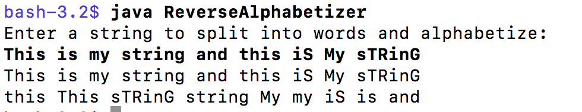

# Problem Set 4: Using a Stack
## Due Monday, February 10 at 11:59pm

---

This problem set has two components: (1) completing an incomplete linked list implementation of a stack ADT; and (2) using that implementation to case-insensitively sort an array of words in reverse alphabetical order. You will have the opportunity to write a bit of your own linked list code and you will discover an application of the stack ADT.

In the `src` directory, you will find three files:

* `Stack.java` An interface for a stack of strings, similar to the one we've seen in class.
* `StackLL.java` An incomplete implementation of the `Stack` interface
* `ReverseAlphabetizer.java` An incomplete class that uses `StackLL` to put the words in a string into alphabetical order.

---

## Part 1
In this part of the problem set, you will be writing `toString()`, the missing method in `StackLL.java`. If you look in the   `StackLL.java` file, you will see commented code. Near the bottom of the file you'll see the words `YOUR CODE GOES HERE`. This is the only place in this file where you need to write any code. 

There are a number of ways you could write this, but I have provided an algorithm that will be easy to implement. These instructions are also included in the `.java` file itself.

1. Create a `StringBuilder` object.
2. Traverse the linked list using a for loop as we have demonstrated in class.
3. As you visit each node, append the item to the `StringBuilder` object followed by a single space.
4. Return the `StringBuilder` object as a String, calling its `toString()` method.

Do not use `push()`, `pop()`, or `peek()`. You should be directly accessing the linked list nodes.

## Part 2
In this part of the problem set, you will be working on the `ReverseAlphabetizer.java` class, which uses two instances of `StackLL` to sort a series of words into reverse alphabetical order. Open the file `ReverseAlphabetizer.java` and you will see that I have provided some basic code for you. All of your code will go in the `main()` method. You do not need to write additional methods or create instance variables.

### Comparing two `String` objects
In class we learned about the `compareTo()` method in `String`. The `compareTo()` method of `String` returns a positive number if the calling `String` comes after the argument `String` in the alphabet; a negative number if the calling `String` comes before the argument `String` in the alphabet; and 0 if the two `String` objects are the same. Example:

```java
String s1 = "animal";
String s2 = "zoo";

System.out.println(s1.compareTo(s2)); // will print -25 because "animal" (s1) comes before "zoo" (s2)
System.out.println(s2.compareTo(s1)); // will print 25 because "zoo" (s2) comes after "animal" (s1)
System.out.println(s2.compareTo("zoo")); // will print 0 because s2 is "zoo", which is the same as "zoo"
 ```

In this problem set, you are going to have to frequently compare two `String` objects to figure out which one comes first in the alphabet. If we were not doing case-insensitive search, you could use the existing `compareTo()` method in `String`. Unfortunately, `compareTo()` is case sensitive; it will put all words beginning with capital letters before words beginning with lowercase letters (e.g., *Dog* would come before *daisy*, even though *dog* would come after *daisy*).

You will have to find a solution to this problem by looking at the [methods described in the Javadoc for `String`](https://docs.oracle.com/javase/8/docs/api/java/lang/String.html#method.summary). There are multiple ways to compare two `String` objects case-insensitively. Any way that consistently works is acceptable.

Note that if you have two versions of the same word with different capitalization patterns (e.g., *Dog* and *dog*, they will have no natural order and can appear in either order in your final reverse-alphabetized stack.


### Running the program
Much to the delight of many of you, we will be using the  `Scanner` class to read in a string from the user during execution of this program. (Recall that previously I was asking you to use command line arguments, i.e., the arguments to main(), i.e., the stuff you would type after the class name when running the program.) I've included the code for using `Scanner` in the `ReverseAlphabetizer.java` file. 

When you run the program you'll just type `java ReverseAlphabetizer` with no arguments. You will then be prompted to enter a string of words. When you hit `return`, the program will process the string you entered.

This is a sample of how we will be running the code when we test your submission:




### The algorithm
Create two `StackLL` objects: one called `mainstack` for storing the reverse alphabetized list of words, and one called `tempstack` for temporarily offloading words fom `mainstack` while you search for the proper location for the incoming word.

This is how the algorithm works. Write a for-loop to go through each word in the array of words from the input string. For each word `w` in the array of words:

* Peek at the top word of `mainstack`. Let's call it `current`. 

* While `current` comes after `w` in the alphabet (see the section above on how to determine this this!), pop `current` off `mainstack` and push it on to `tempstack`. Reset `current` to whatever `peek()` returns.

* When `current` finally comes before `w` alphabetically, push `w` onto `mainstack`.

* Then pop each element off of `tempstack` and push each onto `mainstack`.

* Continue to the next word in the array of words to sort until you have sorted the whole array.

When you are done, you should have a sorted stack of words in `mainstack`, ordered in reverse alphabetical order (z to a) from top to bottom. In other words, the bottom of the stack should have words closer to the beginning of the alpphabet, and the top should have words closer to the end of the alphabet. The stack `tempstack` should be empty. 

Print out the original input `String` followed by the sorted stack (using the `toString()` method you wrote in Part 1) to prove that your code works correctly.


### Some hints and notes

* In your implementation of the sorting algorithm, you will **need** to include one or more checks on the stacks using `isEmpty()`. For instance, if a stack is empty, you shouldn't call `peek()` or `pop()`. If you get a null pointer exception (or worse yet, an infinite loop!), it might be because you are calling `peek()` or `pop()` on an empty stack.

* You will almost certainly get null pointer exceptions. If you get one, you are probably calling `peek()` or `pop()` on an empty stack. You'll need to call `isEmpty()` and/or check whether things `== null` several times.

* Remember that the `compareTo()` method in String is *case sensitive*. That is, capitalized words will always come before uncapitalized words. Search the documentation for `String` to figure out a way to do a case-insensitive comparison. There is more than one way! 

* As you develop your code, you should frequently use the `toString()` method you implemented in `StackLL` to check on the contents of your stacks.

* All of your code in `ReverseAlphabetizer.java` should go in the `main()` method. You do not need to write additional methods, and you do not need any external variables.

* Remember to ABC: **A**lways **B**e **C**ompiling. Compile your code often so that you fix minor errors right away before they cause a cascade of compilation errors.

### Pushing and verifying your submission

Once your code works to your satisfaction, push `StackLL.java` and `ReverseAlphabetizer.java` to your personal master repo on the GitHub Classroom site, as you did for previous problem set. Use the commit message "READY FOR GRADING" so we know you are done. 

As always, you can check to see if it worked by going to GitHub and checking to see if it was updated and whether the files have changed in the way you expected. This is your responsibility.

---

## Important notes on grading

1. The only acceptable way to submit is through GitHub. If you do not submit via GitHub, you will get a 0.

2. The `StackLL.java` and `ReverseAlphabetizer.java` file **must be in the `src` directory**. You will lose 2 points for each file that is in the wrong directory. The best way to make sure they are in the right place is to never ever move them in the first place.

3. Your code must compile. If a class does not compile, you will get a 0 for that class. If you are struggling and you aren't able to get in touch with me or the TAs, any TAs in the lab can help you compile your code.


